

Business-Oriented Synthetic OCR Dataset Generator

Synthetic data generation for hard cases in business documents:
imbalanced fields, tabl[effects](effects)e column merges, and small-text failures.

Designed to address data gaps that block OCR performance
when real samples are missing or expensive to label.

##### OCR models often fail in real business scenarios due to:
- Lack of domain-specific images
- Extremely small text (single digits, specs, quantities)
- Joint text detection in table scene 
- Complex layouts (tables, multi-column documents)
- Occlusions, background noise, and printing artifacts

##### This is Why the Engine Exists. 
- A synthetic data engine that turns OCR failures into reusable learning assets.
- It provides a capability, not just a tool. This is designed for Enterprises in FinTech, Logistics, and Healthcare where data privacy is non-negotiable.  
- Without synthetic amplification, every failed case requires waiting for the next real-world occurrence — how long do you think your clients could wait.  
- In Chinese,Japanese,Korean when you want to improve the precision of the important characters.

This tool is designed specifically for these failure scenario. When real business images are limited but higher precision is required.  

##### Is it also work in VLM era?
- Not every organization has the massive hardware infrastructure required to fine-tune Large Vision-Language Models (VLMs) for specific tasks.
- Curating and labeling high-quality business datasets for VLMs is incredibly time-consuming and expensive.
- Traditional OCR models are lightweight, highly controllable, and significantly easier to fine-tune for niche industrial scenarios.
- In the VLM era, collecting and processing "Edge Data" remains the foundation of any successful AI implementation.
- OCR serves as a reliable "fail-safe" or backup scheme, working alongside VLMs in the backend to ensure system stability and accuracy.
- Modifying the arguments or configure file of VLM for fine-tune may cause another failure case in real-business scene.  

##### What It can't do now.
- If you are looking for a ready-to-use OCR model. (This is a data engine to train models, not a pre-trained model.)
- If you need a "one-fits-all" solution for every industry. (We focus on precision in FinTech, Logistics, and Healthcare, not generic photos.)
- If you expect the engine to "guess" your document structures without any instruction.
- If you are looking for generic Gen-AI to create "pretty pictures" instead of structured, auditable business data. 

### How is the progressions of this project now?
- ✅ Detachable module design.
- ✅ Visualize interaction interface.
- ✅ AI-Powered via LLM model on prompts.
- ✅ Environments simulating are supported.
- ✅ Multiple tasks Parallel execution.
- ✅ Convert docx/doc to labeling file.
- ✅ Produce images and labeling files.
- ✅ Refined the source code of PaddleOCR.
- ✅ Extract different structures into labeling file.
- ✅ Feed image and produce synthetic image to model training are all available now.

##### Showcases:  

Training a High-density Document model and Comparing with original model of PaddleOCR3.x via mobile model instead of server model.

    

        
        
Untrained

    

    

    

        
        
Trained

    

<a href="invoice_comparing/README.md">A description regarding the comparing.</a>

<a href="./purchase_invoice/README.md">A new experiment on purchase invoice.</a>

Convert docx files to PaddleOCR labeling files for model training.

    

        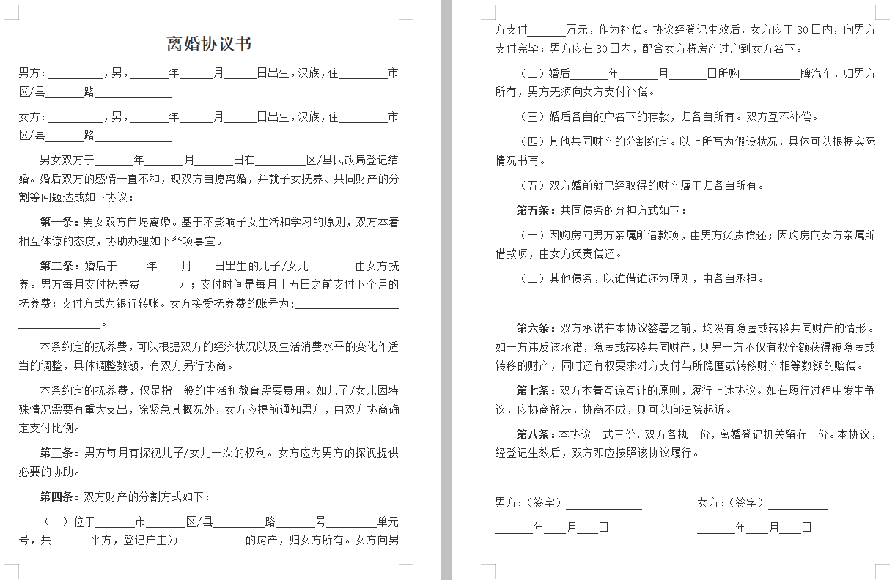
        
Original Docx

    

    

    

        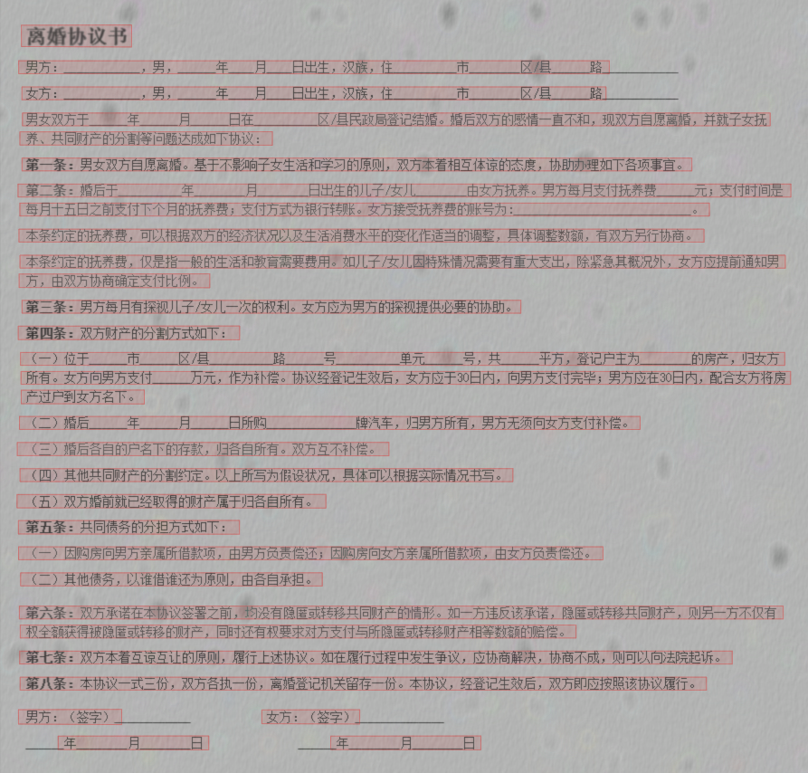
        
After processed

    

##### Below are My examples of effects (the cropped image from the whole image by screenshoot crop): 

👇Multi-language support with diverse font styles.👇   

    
     
    

 

👇Abundant languages supporting: such likes Arabian,Chinese,Japanese,Russian.👇  
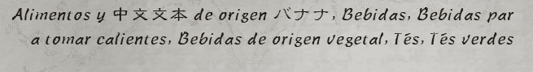  

👇Different text colors.👇  
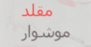  

👇Complicated situations.👇  

    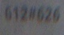
    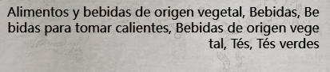
    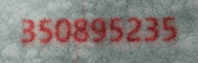
    
    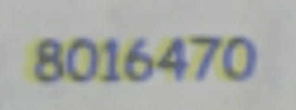
    
    
    

👇With water-mark.👇  
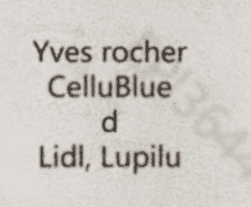  

👇Different shooting angle and curved word.👇  

    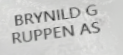
    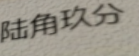

👇Curved text.👇  
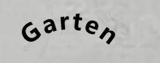  

👇winkled text.👇  

    
    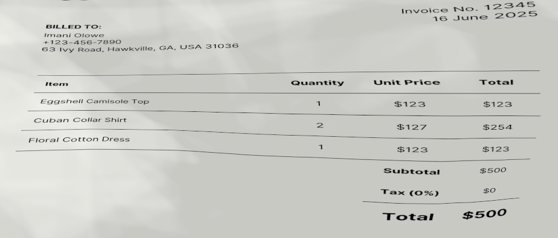

👇Old printer effect with bar-code.👇  
  

👇Simulating word's layout of three columns.👇  
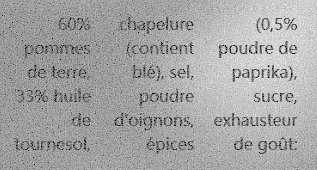  

##### Why Chinese Examples?
(A Stress Test for Generalization) Chinese scripts are the "Final Boss" for OCR due to dense structures and complex strokes with zero spacing cues.  
If the synthetic pipeline can solve the density of Chinese business forms, it generalizes to Latin, Cyrillic, or Arabic scripts with ease. It’s a deliberate design choice to ensure the engine handles the most extreme spatial challenges.  
If a synthetic data pipeline works well on such dense scripts,
it tends to generalize better to other languages.  

##### How does it work?
Providing one or more real business documents or images as input.  
The engine extracts and normalizes document structures
(layouts, fields, tables, reading order)
and performs structure-aware, template-guided synthetic generation
to scale training data under controlled variations.  
These synthetic samples can be rapidly expanded
to form a sufficient dataset for OCR model training,
and are directly convertible to PaddleOCR 3.x labeling format
(with adapters for Tesseract OCR).

On my personal machine:
- CPU: Intel Core i7-14700K.
- GPU: RTX 2080Ti (22GB).
Performance:
- ~1500–2000 images per hour.
- Image resolution: ~2500 × 1800.

##### Is your team facing these bottlenecks?  
- The "Speed-to-Market" Wall: Your sales team needs a demo for a new client tomorrow, but your engineers are still waiting weeks for "enough samples" to start training.
- The "Failed Case" Loop: Customers complain about recurring OCR errors on specific forms, but you can't get enough real-world "failed cases" to fix them without violating privacy laws.
- The "New Form" Crisis: A government department or a key client just launched a new document format. Do you wait 2 months for manual labeling, or do you go live next week?
- The Labeling Money Pit: Your budget is bleeding out into manual labeling services that deliver inconsistent quality.

##### I am looking to partner with Enterprises looking to build a moat in Document AI gradually.
Security & Compliance (The "No-Risk" Clause):
- Data Isolation: The tool runs entirely on-premise. No real business data is ever uploaded or leaves your vault.
- GDPR-Aligned: Specifically architected for compliance in the EU and North American markets.
- No Cloud Dependency: Zero external API calls. Everything stays inside your local infrastructure.
- No Selling Data: the engine produces data securely; no collecting your proprietary information.  
- Reliable: The system is designed so that all training data, generation parameters, and outputs are fully owned and auditable by the enterprise.

Reduce Labeling Cost by 80% with Self-Evolution:
- From Weeks to Days: Generate high-fidelity training data for new document types in days, bypassing the nightmare of manual collection and labeling.
- Customized Pipelines: Tailored synthesis for your specific edge cases (e.g., weird table merges, old-school thermal paper effects).
- Controlled Self-Evolution: Rapid iteration on failed cases with explicit human approval gates before deployment.

### Additional: This project doesn't clone or copy from GitHub.

##### If you have any question or inquiry of this project, just contact to me via the email hi@support.alrowilde.com or publish a short message to issue section.

