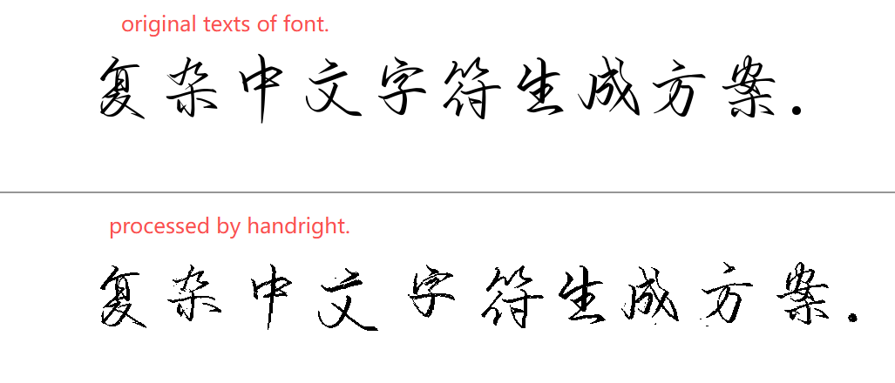
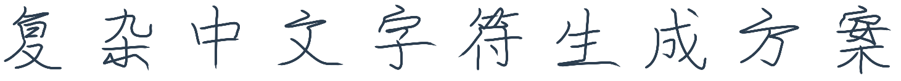
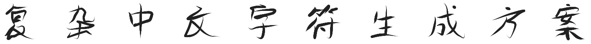
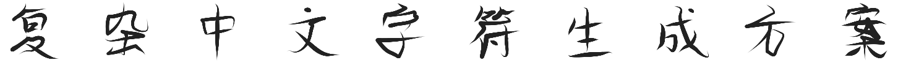
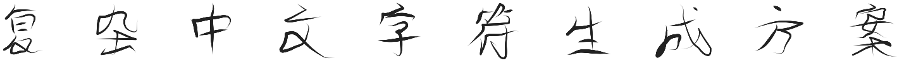
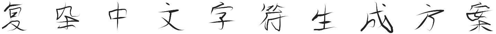
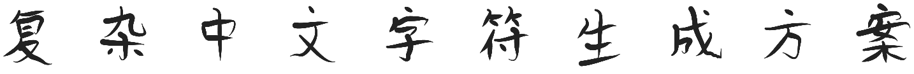
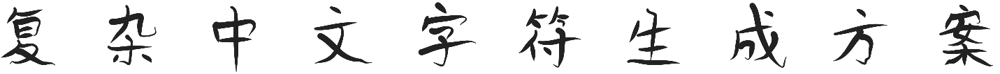

<h2>
In this part, I tried a few methods to implement handwrite by controlled means.
</h2>
<div style="display: flex;flex-direction: column;text-align: center;align-items: end;margin-top:20px">
    <div style="display: flex;flex-direction: column">
        
        <div>
👆HandRight's scheme
<a href='https://www.fonts.net.cn/font-41120854907.html'>Download font</a>👆
</div>
    </div>
    <div style="display: flex;flex-direction: column;padding:20px 60px">
        
        
        
        
        
        
        
        <div>👆My schemes👆</div>
    </div>
</div>
<div style="margin-bottom:50px">
</div>

```python
from PIL import Image, ImageFont, ImageDraw
from handright import Template, handwrite
def create_dynamic_comparison(text, font_path, output_path="dynamic_comparison.png"):
    font_size = 80
    std_font = ImageFont.truetype(font_path, size=font_size)
    # 1. preparing widths of texts.
    bbox = std_font.getbbox(text)
    text_width = bbox[2] - bbox[0]
    text_height = bbox[3] - bbox[1]
    # 2. setting args of layout.
    top_margin = 60
    bottom_margin = 60
    line_spacing = font_size + 20
    canvas_height_half = top_margin + line_spacing + bottom_margin
    # calculating width with font size and margins.
    canvas_width = text_width + 200
    bg_color = 255
    # 3. configuring Handright template.
    template = Template(
        background=Image.new(mode="L", size=(canvas_width, canvas_height_half), color=bg_color),
        font=std_font,
        line_spacing=line_spacing,
        fill=0,
        left_margin=100,
        top_margin=top_margin,
        right_margin=0,
        bottom_margin=bottom_margin,
        word_spacing=5,
        line_spacing_sigma=1,
        word_spacing_sigma=4,
        font_size_sigma=3,
        perturb_x_sigma=3,
        perturb_y_sigma=3,
        perturb_theta_sigma=0.06,
    )
    try:
        handwritten_images = handwrite(text, template)
        hw_img = list(handwritten_images)[0]
    except Exception as e:
        print(f"Handright render failed: {e}")
        return
    # 5. 生成标准对照组
    std_img = Image.new(mode="L", size=(canvas_width, canvas_height_half), color=bg_color)
    draw = ImageDraw.Draw(std_img)
    # keeping align to the left.
    draw.text((100, top_margin), text, font=std_font, fill=0)
    combined_img = Image.new("L", (canvas_width, canvas_height_half * 2), color=230)
    combined_img.paste(std_img, (0, 0))
    combined_img.paste(hw_img, (0, canvas_height_half))
    # a divide line for emphasis.
    draw_line = ImageDraw.Draw(combined_img)
    draw_line.line([(0, canvas_height_half), (canvas_width, canvas_height_half)], fill=150, width=2)
    combined_img.show()
    combined_img.save(output_path)
    print(f"succeed！image's width = {canvas_width}px, height = {canvas_height_half * 2}px")
# the path of font.
text_content = "复杂中文字符生成方案."
font_path = r"C:\Downloads\YeZiGongChangZuiHanJiangXingCao-2.ttf"
create_dynamic_comparison(text_content, font_path)
```
