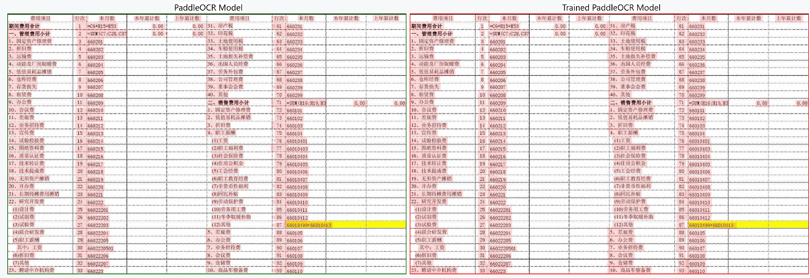
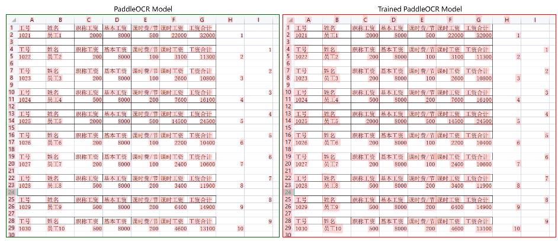
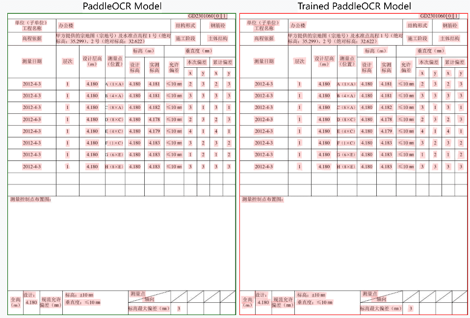
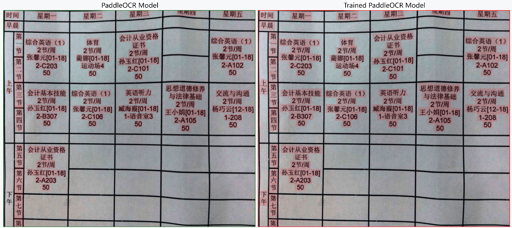

In this part, I trained a model to improve the abilities of OCR on Small texts and column-merged in table scene.

    
    
👆enhance the capability of small text detection👆

    
    
    
    
👆The text be covered by column-line cause the failures👆

    
    
👆Split the texts which merged vertically👆

