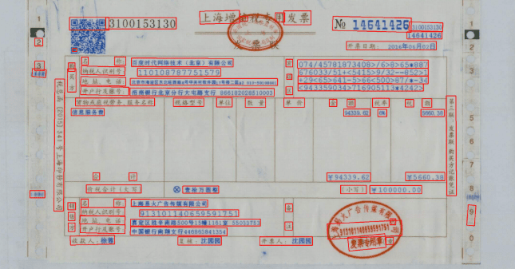
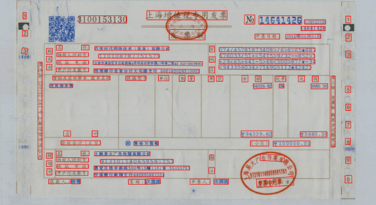

paddlepaddle-gpu=3.2.0  

detector = TextDetection(  
&nbsp;&nbsp;limit_side_len=1440,  
&nbsp;&nbsp;model_name = r'PP-OCRv5_mobile_det',  
&nbsp;&nbsp;model_dir = r'./mobile_opt/inference',  
)

The image come from (BaiDu's public resource)[https://cloud.baidu.com/product/OCR/receipts.html].

Model Training & Evaluation SetupModel:  
- Lightweight mobile model for performance benchmarking.  
- Image Resolution: Original size is 2400w x 1700h.  
- Training & Inference: Trained at d2s_train_image_shape=[3, 960, 960] resolution, and inference performed with limit_side_len=1440.

In this case, I addressed challenges via fine-tune model.  
First of all, the texts covered by company's seal,but we need to extract the title for business classification.  
Secondly, Split the rows from the merged cells and enhanced the stability of extracting of the rules.  
Thirdly, extract the small texts which placed in the sides of invoice,It doesn't important for business,but which enhance the ability of PaddleOCR to detect small texts.  

    

        
        
Untrained

    

    

    

        
        
Trained

    

<a href="../README.md">Back to Home.</a>
