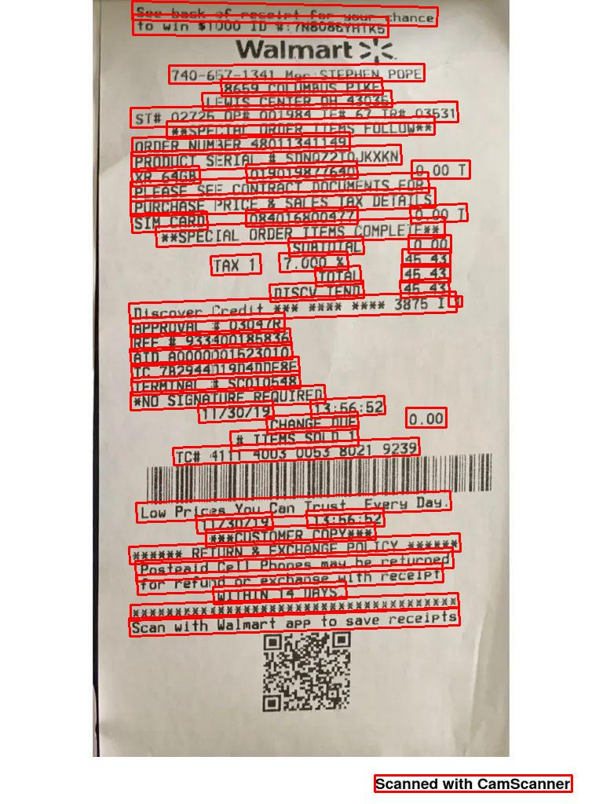
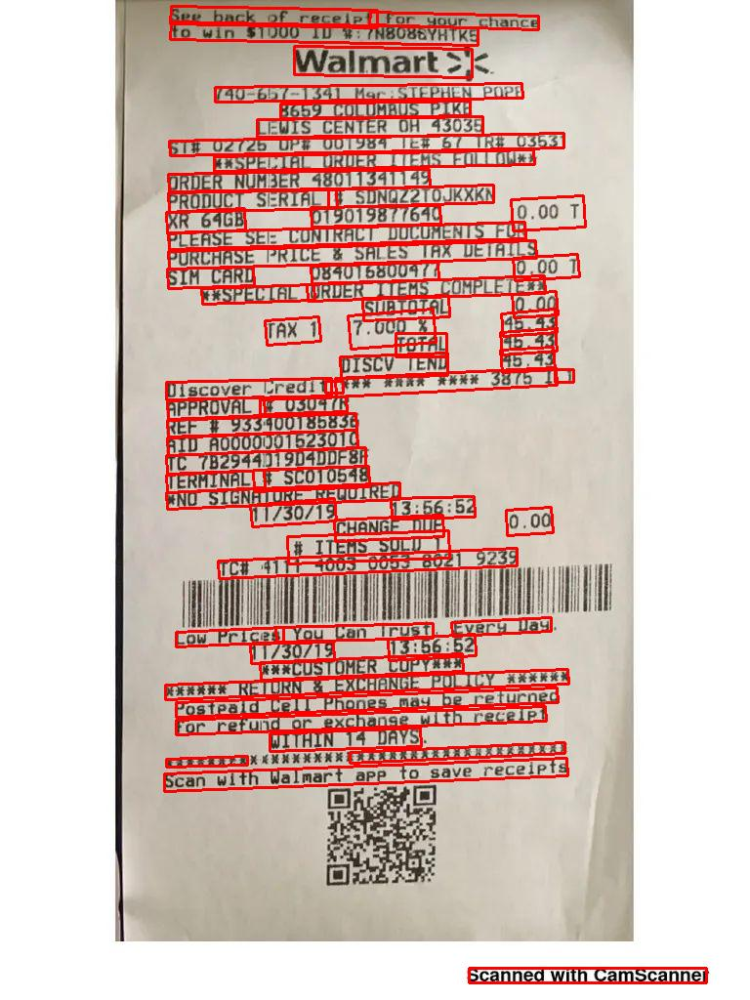

paddlepaddle-gpu=3.2.0  
detector = TextDetection(  
&nbsp;&nbsp;model_name = r'PP-OCRv5_mobile_det',  
&nbsp;&nbsp;model_dir = r'./mobile_opt/inference',  
)  

By training with images that mimic the actual layout of purchase invoices, 
I successfully improved the model's precision in capturing domain-specific features.

While the gap between this and the original PaddleOCR model is narrowing, 
the experiment confirms that layout similarity is a critical factor
in boosting model capability for specialized business scenarios.

    

        
        
Untrained

    

    

    

        
        
trained

    

<a href="../README.md">Back to Home.</a>

