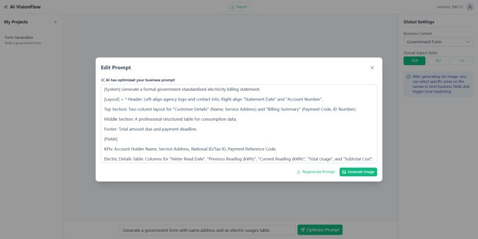

## Synthetic Business Document Generator

**Generate high-precision, labeled business documents for AI model training — privately and on-demand.**

### What could the engine do?

lets you create realistic, diverse business forms and documents (invoices, bills, receipts, government forms, statements, etc.) using natural language prompts.

Instead of generic beautiful pictures, it focuses on:

- perfect layout accuracy  
- 100% consistent & correct labels (names, numbers, dates, amounts, meter readings…)  
- Built-in variability & edge cases  
- Full privacy (runs locally or in your secure environment)

Perfect for training/fine-tuning **OCR**, **VLM**, **document understanding**, **layout parsers**, **table extraction**, and **YOLO-style object detection** models.

### System Preview:

    

        
        
Preview

    

### Examples:

    

        
        
Generated By The Engine

    

