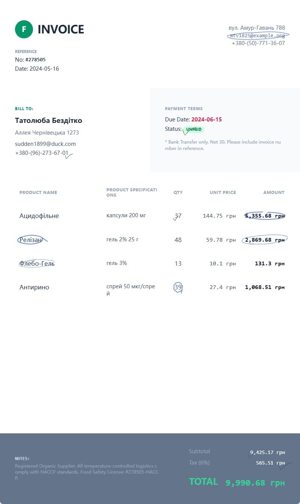

# AI Business Synthesis System

**Type one short prompt → Get labeled business documents in seconds.**

The core engine of **ocr-producer**.  
A 100% local, AI-powered synthetic document generator that turns natural language into production-ready, auto-annotated business visuals (invoices, utility bills, contracts, logistics slips, medical forms, and more).

Built specifically for enterprises that run private VLM/OCR models but lack high-quality, domain-specific training data.

---

### 🎥 70-Second Full Workflow Demo

<video src="https://github.com/user-attachments/assets/be75344b-2adc-46cc-a279-1d6fd1b58649" controls width="100%">
  Your browser does not support this video.
</video>

(From a simple prompt to final annotated document — no cloud, no data leakage)

---

### What It Does

- Generates **realistic, structured business documents** from plain English
- Automatically creates ** PaddleOCR / JSON annotations** (field-level labels)
- Handles complex real-world challenges: small text, merged cells, tables, watermarks, noise, distortion, multi-column layouts
- Full multilingual support (Arabic, Chinese, English, Japanese, Russian, etc.)
- Handwriting simulation mode available for advanced training scenarios
- 100% local execution — your data never leaves your infrastructure

### Full Workflow (as shown in the video)

1. **Define your needs** — Type a short prompt or choose a preset (Utility Bill, Invoice, Loan Statement, etc.)
2. **AI generates detailed prompt** — Structured layout + field definitions
3. **Review & edit** — Full control over every section
4. **Generate synthetic image** — One-click creation of the visual document
5. **Local refinement** — Modify any part and regenerate instantly
6. **Export** — Download the final high-resolution image + annotation files

From one prompt to hundreds of labeled business images in minutes.

---

### Key Features

- **Privacy-first**: Runs entirely on your hardware (RTX 2080 Ti or better recommended)
- **Production-ready annotations**: Compatible with PaddleOCR 3.x and most VLM training pipelines
- **Self-evolving**: Continuously learns and generates new document formats
- **Enterprise ready**: GDPR/CCPA compliant, modular, supports DOCX template import

---

### Examples

More examples and generated datasets are available in the [parent repository](../README.md).

---
